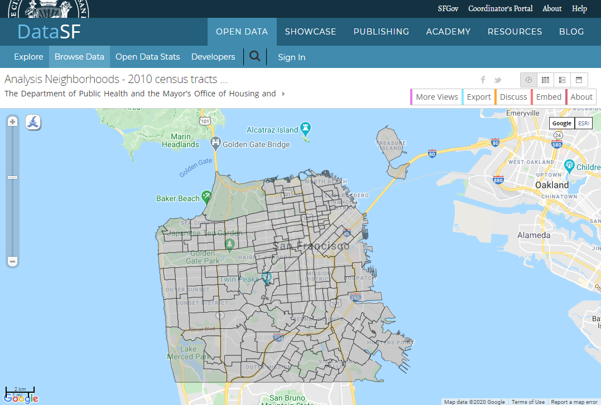
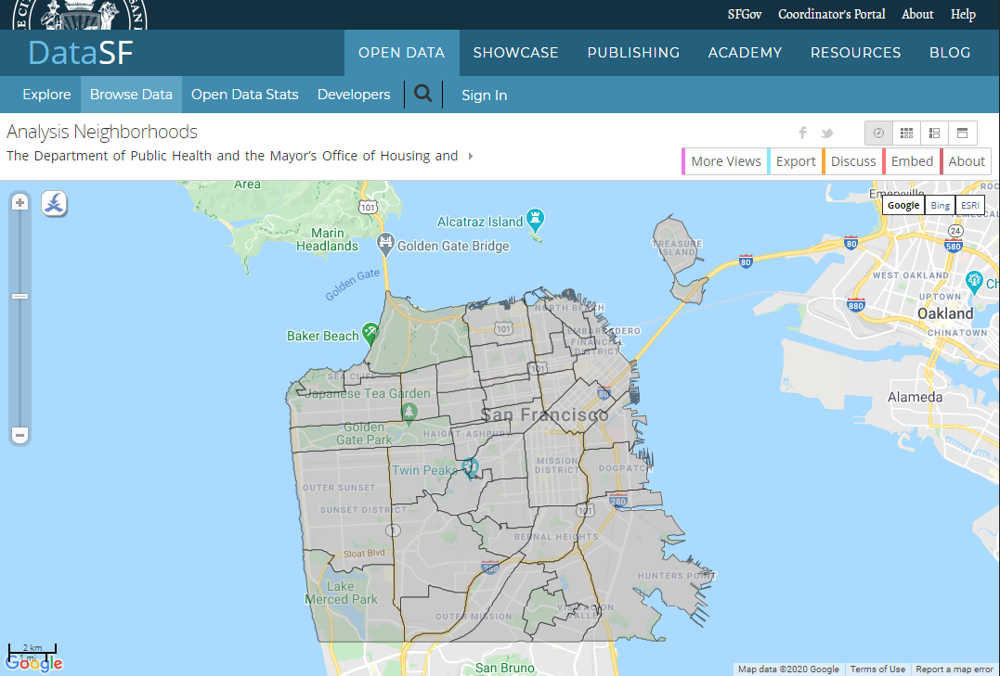

# San Francisco Bubble Tea Business Analysis Report
This project aims to utilize a data science skillset and the CRISP-DM methodology to answer a business question. 
We define a business problem, gather data needed to solve that problem, perform data preprocessing, create a model, evaluate the results, and provide a conclusion that can be leveraged.

## Table of Contents
1. Executive Summary
2. Introduction
3. Methodology
4. Results
5. Discussion
6. Conclusion

## 1. Executive Summary
This report investigates the best neighborhood to start a bubble tea shop in San Francisco. Using census data from the US Census Bureau, neighborhood definitions from San Francisco City Government, and venue data from Foursquare, data was gathered and fed into a K-Means algorithm based model. This machine learning model reveals that the best location to start a bubble tea business is in Chinatown, due to its high population density and proximity to other bubble tea shops. Thus, it is recommended that an inspiring entrepreneur looks towards Chinatown as a location of choice if the model assumptions align with their business analyses.

## 2. Introduction
San Francisco is one of California's major cities. Although founded as a Spanish colony in the 18th century, it was not until the California Gold Rush did the city experience rapid growth.Immigrants all over the world, spurred by promises of boundless wealth, rushed to California to strike it rich.As these immigrants settled down in San Francisco, the city became known for its diversity. Even today, San Francisco has a majority minority population and possesses a high concentration of people of Asian ancestry.[1]

Bubble tea, also known as pearl milk tea or boba, is a popular drink originating in Taiwan. Invented in the 1980's, bubble tea quickly became popular as both a drink and a symbol of culture. 

The objective of this project is to answer the following question: Where would be the best neighborhood in San Francisco to open a bubble tea store?

## 3. Methodology
To answer the question, one must define what "best neighborhood" indicates.
The "best neighborhood" to open a bubble tea store is a neighborhood with a dense population, yet has few competitors. Surrounding neighborhoods should also share these factors. For the purpose of determining the best location, a K-Means algorithm can be used to group similar neighborhoods based on proximity to other neighborhoods, population density, and store density.

Assumptions must then be made, either for ease of processing or data availability.
1. Store density, or stores per square mile, is generally an advantage. While one may think that a lack of competition in a given area is beneficial, the opposite tends to be true. Similar businesses tend to cluster up. For example, major casinos cluster in Las Vegas. Although competition is fierce among businesses, high traffic to the area allows businesses to thrive [2]
2. Eulidean distance is a fair estimate of the distance between two neighborhoods.
3. Foursquare, the API used to collect information on existing bubble tea shops, has (at least) even coverage. Regions are equally represented. 
4. A higher population density is preferred regardless of that population's demographics. In other words, we assume there is not a demographic bias in the bubble tea market. 
### 3.1 Data Acquisition
#### 1. Census Tract Population Data

[2010 Census Tract Data - State of California](https://www2.census.gov/geo/docs/reference/cenpop2010/tract/CenPop2010_Mean_TR06.txt)

To determine how population is distributed, one can look at census tracts. Census tracts are the smallest geographical unit for which detailed census data is provided [3]
#### 2. San Francisco Census Tracts

[SF Census Tract Data](https://data.sfgov.org/Geographic-Locations-and-Boundaries/Analysis-Neighborhoods-2010-census-tracts-assigned/bwbp-wk3r)

Which census tracts fall within San Francisco City proper? This data is defined and provided by the San Francisco City Government.
#### 2. San Francisco Neighborhoods

[SF Neighborhood Data](https://data.sfgov.org/Geographic-Locations-and-Boundaries/Analysis-Neighborhoods/p5b7-5n3h)

The concept of a "neighborhood" is colloquial and thus neighborhoods do not possess clear lines of demarcation. 
In order to determine neighborhoods and process data, it would be useful to have this data. 
Thus, we will use the San Francisco City Government's definition of these neighborhoods with their clear lines of demarcation, as they are a first-hand source.
#### 3. Foursquare Venue Data

[Foursquare Places API](https://foursquare.com/developers/apps)

Foursquare is used to determine the location of bubble tea stores in San Francisco. 
Foursquare possesses a large number of venues and separates them into categories, one of which is bubble tea stores.
The Foursquare API is also free to use (within certain limits, of course)

### 3.2 Data Preprocessing
After data is obtained from the various data sources, data can be explored and processed.  
To ensure the validity of the data provided, a visualization of tracts and neighborhoods is provided. 

<figure>
    
    <figcaption> Figure 1: Map of San Francisco proper, divided into tracts and neighborhoods. Tracts evenly divide the neighborhoods.</figcaption>
</figure>

Tract numbers are unique to counties only. Therefore, it is necessary to first filter the census tract data by county number ("075" for San Francisco County) to ensure proper merging of tables later on.

<figure>
    
    <figcaption> Figure 2: San Francisco County, Tracts Data </figcaption>
</figure>

Once filtered, we can merge the census tract population data with the relevant San Francisco tract data to obtain population and area per tract.

<figure>
    
    <figcaption> Figure 3: San Francisco City, Tracts Data </figcaption>
</figure>

This can then be grouped by neighborhood to obtain each neighborhood's area and population.

<figure>
    
    <figcaption> Figure 4: San Francisco Neighborhoods Data </figcaption>
</figure>

For each of San Francisco's 41 neighborhoods, we now have each neighborhood's population and area. 

In an ideal world, one could simply query Foursquare's API to find all bubble tea shops in San Francisco. The API, however, limits us to 100 locations per call. In order to obtain all locations, multiple calls will be needed.

Foursquare uses a single location and a radius to search for venues. Therefore, one must first find the center of each neighborhood. In the San Francisco Neighborhood dataset, each neighborhood is defined by its boundaries as a series of points. Using the Shapely library, these points are transformed into a polygon. The centroid of the polygon is then found.

<figure>
    
    <figcaption> Figure 5: San Francisco Location Data. "LONGITUDE" and "LATITUDE" columns represent the center of each neighborhood</figcaption>
</figure>

A radius is then approximated based on the area of the neighborhood and a coverage factor is applied so no significant area is missed when querying Foursquare's API for results. The resulting map is shown below:

<figure>
    
    <figcaption> Figure 6: San Francisco Coverage </figcaption>
</figure>

We now have each neighborhood's center and an approximate radius which covers the neighborhood.

This data is then fed into Foursquare's API to obtain all bubble tea locations in San Francisco proper. 

<figure>
    
    <figcaption> Figure 7: Obtained bubble tea locations </figcaption>
</figure>

However, since there is significant overlap between the queries, we filter for locations:

<figure>
    
    <figcaption> Figure 8: Unique bubble tea locations </figcaption>
</figure>

We are able to determine that there are 143 unique bubble tea locations. 

To determine which bubble tea shop is in which neighborhood, we can use the Shapely library. This will allow us to determine the density of bubble tea shops in each neighborhood and will also filter out shops that are not within San Francisco proper.

<figure>
    
    <figcaption> Figure 9: Bubble tea locations, categorized </figcaption>
</figure>

A single location is filtered out as it is not within San Francisco proper. A visualization of the data on a map can be seen below.

<figure>
    
    <figcaption> Figure 10: Bubble tea location map </figcaption>
</figure>

This data is further processed to determine each neighborhood's population density and bubble tea store density. 

This data, along with each neighborhood's geographical center, is normalized before being inputted into the model algorithm. This ensures that the model is not biased towards a single variable.

### Model Selection
A K-Means model is chosen as it will group together neighborhoods based on proximity, population density, and competition (store density). 

To ensure the number of clusters in the K-Means model is not overfitting or underfitting the data, the elbow technique is used. Using the Yellowbrick library, a range of K values are selected to determine the "elbow" in the clusters vs. distortion score graph. This value is then selected for the final K-Means model.. 

## 4. Results
<figure>
    
    <figcaption> Figure 11: K-Means elbow visualization </figcaption>
</figure>  

As seen above, the ideal number of clusters (k) is 7. This number is then used to create the final model.

<figure>
    
    <figcaption> Figure 12: Clustered data, density chart </figcaption>
</figure> 

<figure>
    
    <figcaption> Figure 13: Clustered data, location map.  </figcaption>
</figure> 

Note: Legend of Figure 12 applies to Figure 13

## 5. Discussion

Based on the model, constructed by the data gathered, a neighborhood of Chinatown seems to be the most ideal neighborhood for a bubble tea store.

As seen in *Figure 12*, the clustering of neighborhoods based on population density and store density indicates two clear outliers - cluster 2 and cluster 4. Cluster 2 consists solely of the Chinatown neighborhood, where population density and store density are both high. As both population density and store density are beneficial factors to a new bubble tea shop, Chinatown seems to be the ideal neighborhood.

Notably, cluster 4, consisting of Tenderloin and Nob Hill, is also an outlying cluster based on population and store density. The remaining clusters are similar in respect to population and store density, and thus, seem to be grouped primarily based on location. Cluster 3 contains multiple neighborhoods located closely to one another, with higher average population density than the rest and slightly higher store density. These could also be potential neighborhoods.

There are several important caveats to be noted in this discussion. If one believes that it is more beneficial to be in a populous area but away from potential competition, Cluster 4, possesses the ideal characteristics. It has a high population density, but has a store density comparable to the other clusters. Thus, cluster 4's neighborhoods could be prime candidates for bubble tea stores.

The grouping of such neighborhoods is arbitrary and not all neighborhoods are the same size. Although this factor is considered, the variables of location, population density, and store density are all normalized with respect to each other. If say, population density is less important than distance, a cost function should adjust the normalized values to put more emphasis on location. 

It is also important to note that the distance between two points in the algorithm is Euclidean. Although it is a far assumption for population density and store density, the physical latitude and longitude between two locations in the real world is not necessarily best approximated with Euclidean distance. It may be that densely populated areas are more difficult to navigate and thus take more time to drive through. Terrain serves as another potential complicating factor, warping the distance between two neighborhoods.

The fidelity of the data can also be called into question. Foursquare may not equally represent all neighborhoods. As this analysis is only based on 142 unique bubble tea stores, just a handful can drastically change the model and the resulting analysis.

Finally, demographics of the bubble tea business is not considered. As bubble tea has its origins in Taiwan approximately 40 years ago, it is reasonable to believe that the demographic for bubble tea skew towards the younger side and towards Asians. Before final conclusions are drawn, demographic data should be factored into this analysis.

## 6. Conclusion

Based on the available data and the underlying assumptions, the neighborhood of Chinatown is the ideal place to start a bubble tea store. This is due to its high population density and its location near other neighborhoods with high population density, ensuring plenty of traffic. With several existing stores in the neighborhood, a bubble tea shop in Chinatown can also experience plenty of traffic not local to just nearby neighborhoods. 

The identified assumptions can be analyzed and the model improved upon to give a better determination of the best neighborhood for a bubble tea store. Furthermore, this same model can be used for businesses with tangential business models and goals, such as restaurants specializing in certain cuisines, cafes, bakeries, food trucks, etc. 

This project acts as an jumping-off point in which more complex problems can be tackled using data science and data science methodologies. 

---
## Sources
[1]https://en.wikipedia.org/wiki/San_Francisco

[2]https://www.inc.com/encyclopedia/clusters.html

[3]https://guides.library.oregonstate.edu/c.php?g=376879&p=2550439

Code is available on [Github](https://github.com/sanders-li/Coursera-Capstone/blob/master/San%20Francisco%20Bubble%20Tea%20Data%20Science%20Analysis/SF%20Neighborhood%20Analysis.ipynb)
